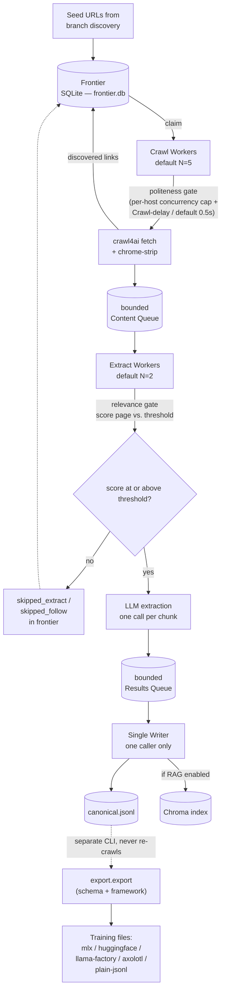

# scraper

A general-purpose, prompt-steered crawler: give it a root URL and a
natural-language intent, and it crawls the site, judges each page against
that intent, and turns the result into LLM training datasets (multiple
schemas, packaged for several fine-tuning frameworks) plus a Chroma RAG
index. It is **not** documentation-specific — docs sites are one input type
this has been tested against, not the target; it has also been run
end-to-end against a general blog (`blog.cloudflare.com`).

This is the operating manual: how to run it, every flag, where output goes,
and what its real limits are. For *why* things are built the way they are,
see `CLAUDE.md`. For the problem → root cause → fix history, see
`LESSONS_LEARNED.md`. For known gaps and unbuilt work, see `ROADMAP.md`.

## Quickstart

Requirements: Python 3.12 (not 3.13 — pinned in `pyproject.toml`), a local
[Ollama](https://ollama.com) install, and [`uv`](https://docs.astral.sh/uv/).

```bash
git clone <this repo>
cd scraper
uv sync
```

`uv sync` reads `pyproject.toml` + `uv.lock` and creates `.venv/`. Before any
`uv sync`/`uv pip install`/`uv pip sync` that could touch an environment
other than this project's own `.venv/`, run it with `--dry-run` first and
check the resolved target path — see `CLAUDE.md`'s uv-workflow section for
why.

**One-time browser setup** — `crawl4ai` drives a real headless Chromium via
Playwright, which pip alone does not install:

```bash
uv run crawl4ai-setup
```

This downloads Chrome/Chromium binaries to a user-level cache
(`~/AppData/Local/ms-playwright/` on Windows, `~/.cache/ms-playwright/` on
Linux/macOS) — a few hundred MB, one-time, idempotent. Run
`uv run crawl4ai-doctor` if a later crawl fails with a browser-launch error.

**Local Ollama** — required for embeddings on every run, regardless of which
chat/extraction provider you pick (see "Provider routing" in `CLAUDE.md`):

```bash
ollama pull nomic-embed-text   # the only embedding model this project uses
ollama serve                    # must be running on localhost:11434 during a crawl
```

**API keys** — copy `.env.example` to `.env` and fill in only the key for
the provider you intend to use for chat/extraction:

| Variable | Needed for | Get it from |
|---|---|---|
| `OPENAI_API_KEY` | OpenAI provider | platform.openai.com |
| `NVIDIA_API_KEY` | NVIDIA NIM provider | build.nvidia.com (free tier) |
| `OLLAMA_API_KEY` | Ollama cloud provider | ollama.com/settings/keys |

Local Ollama (chat) needs no key. Embeddings never need a key — they always
go through local Ollama regardless of which provider above you pick.

**First crawl.** `main.py` is interactive; there's no flag for a "real"
crawl, you answer prompts. A safe first run — small, cheap, log-only
thresholds so nothing silently gets dropped:

```bash
uv run python main.py
```

```
Enter the Root URL to start discovery: https://example-blog.com
Describe what you want from this site: how to configure and deploy the product
Enter comma-separated IDs of branches to crawl, or 'all': all
Select LLM Provider (chat/extraction): 4          # OpenAI
Enter model name for openai: gpt-4o-mini
Build Vector RAG index (Chroma)?: n
Max pages to fetch (blank = unlimited): 20
Max crawl depth (blank = unlimited):
Extraction relevance threshold (0):                # leave at 0 for a first run
Follow relevance threshold (0):
Concurrent crawl workers (5):
Concurrent extract workers (2):
```

This produces `data/run/canonical.jsonl`. Turn it into a training file:

```bash
uv run python -m export.export data/run/canonical.jsonl \
    --schema alpaca --framework huggingface --out data/export/alpaca-hf
```

Run as a module (`-m export.export`), from the repo root — `python
export/export.py` breaks on its own absolute imports.

## CLI reference

There is one entry point, `main.py`, with two modes: no flags starts the
interactive crawl; any of the flags below runs a single offline command and
exits. `export/export.py` is a separate CLI (a different Python file), for
turning a finished crawl into a training file.

### `uv run python main.py` — interactive crawl

No flags. Prompts, in order:

1. **Root URL** — where discovery starts.
2. **Intent** — free text describing what you want. Blank = no relevance
   filtering at all, every fetched page gets extracted regardless of
   threshold values below.
3. **Branches** — discovery groups the root page's links by host/path
   prefix and shows a numbered table; enter comma-separated IDs or `all`.
4. **LLM provider** for chat/extraction: NVIDIA NIM, Ollama (local), Ollama
   (cloud), or OpenAI. Embeddings are unaffected by this choice.
5. **Model name** for that provider (a sensible default is offered).
6. **Build Vector RAG index?** — y/n. If yes, every extracted page's content
   also gets chunked, embedded, and upserted into Chroma.
7. **Max pages** — blank means unlimited. See "Known limitations" below:
   this is a budget, not a hard ceiling.
8. **Max depth** — blank means unlimited.
9. **Extraction relevance threshold** and **Follow relevance threshold** —
   both default to **0**, which is log-only: nothing gets skipped, every
   page's relevance score still gets computed and recorded. This is
   deliberate — pick a real threshold from `--score-report` after a
   log-only run, not by guessing beforehand.
10. **Concurrent crawl workers** (default 5) and **concurrent extract
    workers** (default 2).

Ctrl-C stops cleanly (`KeyboardInterrupt` is caught). Re-running against the
same `data/run/frontier.db` resumes it — `recover_crashed()` requeues
anything left `in_progress`, and already-extracted pages are not
re-extracted (`Writer` scans `canonical.jsonl`'s `source_url` field on
startup).

### `--dry-run URL`

```bash
uv run python main.py --dry-run https://example.com
```

Fetches the root page, runs branch discovery, and prints accept/reject +
reason for every discovered href against each branch's derived scope. No
crawl, no LLM calls — one cached network fetch. Use this before a real
crawl to sanity-check that scope discovery is doing what you expect on a
new site.

### `--score-report FRONTIER_DB`

```bash
uv run python main.py --score-report data/run/frontier.db
```

Prints the relevance score distribution recorded in an existing frontier
DB — min/max/mean/median/stdev, every page's score sorted high to low, and
a skip-fraction table for candidate thresholds 0.1–0.9. Offline, no LLM
calls. **Prerequisite**: a completed or in-progress crawl against that DB —
run this after a threshold-0 crawl to pick a real threshold from data
before running the same site again with the gate on.

### `--query "QUESTION"`

```bash
uv run python main.py --query "How do I configure retries?"
```

Embeds the question, searches the persisted Chroma collection, prints each
result's parent text, sources, matched child chunk, and distance.
**Prerequisite**: a prior crawl with "Build Vector RAG index?" answered
yes — this reads `config.CHROMA_PERSIST_DIR`, and exits with an error if no
collection exists there. One live embedding call.

### `--dataset-report CANONICAL_JSONL [--dataset-report-frontier-db FRONTIER_DB]`

```bash
uv run python main.py --dataset-report data/run/canonical.jsonl \
    --dataset-report-frontier-db data/run/frontier.db
```

Reports pair counts, pairs-per-page stats, exact-duplicate question counts,
and near-duplicate questions/answers (classified as adjacent-chunk overlap
vs. same-chunk paraphrase padding). The frontier DB is optional — pass it to
also cross-reference relevance scores against what got extracted. Offline,
no LLM calls, reads only what a completed run already wrote to disk.

### `uv run python -m export.export CANONICAL_PATH --out DIR --schema SCHEMA [options]`

The only way to turn `canonical.jsonl` into a training file. Never
re-crawls. Pipeline: validate → dedup (exact) → optional semantic dedup →
split → schema projection → framework packaging.

Required:
- `canonical_path` (positional) — path to a `canonical.jsonl`.
- `--out DIR` — output directory (created if missing).
- `--schema` — one of:
  - Per-record: `conversational`, `alpaca`, `prompt_completion`,
    `embedding_pairs`, `rag_eval`, `openai_finetune`, `vertex`
  - Batch (whole-dataset transforms, ignore `--framework`): `raw_text`
    (dedups across records), `triplets` (mines a negative example from a
    different page)
  - Refused loudly, not attempted: `dpo`, `orpo`, `kto`, `classification` —
    each needs information (a rejected answer, a desirability label, class
    labels) this export layer doesn't generate.

Optional:
- `--framework` (default `plain-jsonl`) — `mlx`, `huggingface`,
  `llama-factory`, `axolotl`, `plain-jsonl`. **Not every schema is
  supported by every framework** — an unverified (schema, framework) pair
  raises `ValueError` and refuses to emit a guessed mapping. Verified
  combinations:
  - `mlx`: `conversational`, `openai_finetune`, `prompt_completion` only
    (mlx-lm's LoRA trainer auto-detects exactly 4 shapes; `alpaca` is not
    one of them).
  - `llama-factory`: `alpaca`, `conversational`, `openai_finetune`.
  - `axolotl`: `alpaca` (→ `type: alpaca`), `conversational` /
    `openai_finetune` (→ `type: chat_template`).
  - `huggingface` and `plain-jsonl`: schema-agnostic, work with any
    per-record schema.
- `--min-answer-length` (default 20) — validation rejects shorter answers.
- `--split-by` (default `section`) — `section` or `source_url`; train/val/test
  split is always grouped (never a random row-level split), so near-duplicate
  content from the same page/section can't leak across splits.
- `--seed` (default 42) — split is deterministic given the same seed.
- `--intent` — free text recorded on the dataset card, not functional.
- `--section-depth` (default 2) — currently a no-op for filenames
  (`ROADMAP.md` #30); still affects the dataset card.
- `--semantic-dedup` — drop pair-level near-duplicate answers on the same
  page (`SequenceMatcher` ratio ≥ threshold) after exact dedup. **Off by
  default** — see "Known limitations."
- `--semantic-dedup-threshold` (default 0.4) — the ratio threshold above.
- `--semantic-dedup-report` — write `semantic_dedup_report.json` listing
  what `--semantic-dedup` *would* drop at the given threshold, without
  dropping anything. Works with or without `--semantic-dedup` — the
  intended way to pick a threshold from real data before turning the flag
  on for real.

Example — the combination actually run in this project's Phase 2 test:

```bash
uv run python -m export.export data/run/canonical.jsonl \
    --schema conversational --framework mlx --out data/export/mlx-conv \
    --semantic-dedup-report
```

Every export writes `dataset_card.json` (sites, dates, intent, model, row
counts, license signals observed). `--semantic-dedup` alone also writes
`semantic_dedup_report.json` when `--semantic-dedup-report` is passed.

## Architecture



Notes that don't fit in the diagram:

- **The relevance gate is two separate thresholds**, not one. *Extraction
  threshold* decides whether a fetched page gets sent to the LLM.
  *Follow threshold* decides whether that page's own discovered children get
  promoted to `queued` or dropped to `skipped_follow` — a low-scoring page's
  links aren't crawled deeper. The one seed page's own children are always
  exempt from the follow gate (`config.FOLLOW_GATE_EXEMPT_DEPTH`), so
  depth-1 breadth is never gated on the root's own score.
- **Politeness applies only at the crawl-worker → fetch step** — it caps
  concurrent in-flight requests per host and enforces spacing between
  requests to that host (a site's own `Crawl-delay` in `robots.txt`
  overrides the project default). It never touches the extract/write side.
- **The writer is a hard single point** — `crawl_worker`/`extract_worker`
  cannot structurally hold a reference to it (enforced by a dedicated test,
  not just convention), so it needs no internal locking, only a guard that
  raises loudly if ever called concurrently.
- **Export never touches the frontier or re-crawls** — it's a pure
  transform over `canonical.jsonl`, run as its own CLI invocation.

## Output layout

```
data/
  run/                    # one crawl's state — never a deliverable, overwritten/resumed in place
    frontier.db           # SQLite: URL state machine, scores, retry bookkeeping
    frontier.db-shm/-wal  # SQLite WAL files
    canonical.jsonl        # the master file — see below
    chroma_db/             # only if "Build Vector RAG index?" was yes
  export/                 # your own --out target(s), one directory per export call
    <format>/train.jsonl / valid.jsonl / test.jsonl / dataset_card.json / ...
```

**`canonical.jsonl` is the master record, never a training file directly.**
One JSON object per Q&A pair, written by exactly one process (`Writer`).
Fields: `question`, `answer`, `source_chunk` (the exact text unit that
produced this pair — kept so redundancy analysis can tell adjacent-chunk
overlap from same-chunk padding), `chunk_index`, `source_url`, `section`,
`page_title`, `generation_model`, `extraction_strategy`, `timestamp`,
`crawl_date`, `license_signal` (best-effort text-pattern match, not a legal
determination).

Every training format is a *projection* of this file — regenerating a
different schema or framework packaging never requires re-crawling, only
re-running `export.export` with different flags. This is why every field a
future projection might plausibly need is captured at crawl time, even ones
nothing currently reads.

There is no crawl-time per-section split — `canonical.jsonl` is always one
unified file. Per-section splitting happens only at export time
(`plain-jsonl` packaging's `manifest.json` + `sections/*.jsonl`).

## Configuration reference

All in `config.py`. Nothing here is a CLI flag — change the file and
re-run.

| Setting | Default | Real consequence of changing it |
|---|---|---|
| `MAX_RETRIES` | 3 | Total attempts (including the first) before a failed fetch/score/extract gives up and marks the row permanently `failed`. Retries re-fetch, not just re-extract. |
| `FOLLOW_GATE_EXEMPT_DEPTH` | 0 | How many levels from the seed are exempt from the follow-threshold gate. Raising it widens guaranteed breadth before relevance starts pruning links, at the cost of crawling more off-topic pages near the root. |
| `MAX_CONCURRENT_REQUESTS_PER_HOST` | 2 | Politeness: concurrent in-flight requests to one host, independent of total crawl-worker count. Raising it crawls faster but is more aggressive against the target site. |
| `DEFAULT_POLITENESS_DELAY_SECONDS` | 0.5 | Minimum spacing between requests to a host with no `Crawl-delay` of its own. A site's own robots.txt value always overrides this. |
| `PARENT_CHUNK_SIZE` / `PARENT_CHUNK_OVERLAP` | 2000 / 200 | Size of the RAG parent chunk and the retrieved-context unit for `--query`. |
| `CHILD_CHUNK_SIZE` / `CHILD_CHUNK_OVERLAP` | 400 / 200 | Size of the embedded/searched RAG unit. **`CHILD_CHUNK_OVERLAP` at half of `CHILD_CHUNK_SIZE` is a measured, documented cause of vector-count bloat** (9,204 vectors from 30 pages in an earlier audit) — see `LESSONS_LEARNED.md` #19 before changing either. |
| `EXTRACTION_STRATEGY` | `PER_CHUNK` | `PER_CHUNK` (one LLM call per parent chunk, complete but N calls/page — **this is the real throughput bottleneck**, see below), `FIRST_N_CHARS` (1 call/page, cheapest, silently drops everything past the opening slice of a long page), or `TOP_K_CHUNKS_BY_RELEVANCE` (cheaper than `PER_CHUNK`, needs a real intent to rank against). |
| `EXTRACTION_TOP_K` | 3 | Chunks kept per page under `TOP_K_CHUNKS_BY_RELEVANCE`. |
| `MAX_EXTRACT_CHARS` | 4000 | Hard cap per extraction-unit call to the LLM. |
| `LLM_EXTRACT_TIMEOUT_SECONDS` | 600 | Real extraction calls have been observed taking up to 153s; this is a genuinely dead-connection timeout, not a slow-call timeout — don't lower it without headroom over your provider's real latency. |
| `OLLAMA_EMBED_TIMEOUT_SECONDS` | 60 | Local calls normally take 2–6s; this is generous headroom, not tight. |
| `SECTION_DEPTH` | 2 | How many leading URL path segments form one "section" (canonical record field + export-time file grouping). |

Relevance thresholds (extraction and follow) and worker counts are **not**
in `config.py` — they're interactive prompts, deliberately, so they're
picked per-crawl from `--score-report` data rather than baked in globally.

## Known limitations

- **`max_pages` is a budget, not a hard ceiling.** The cap check only gates
  *new* claims; rows already claimed and mid-flight all finish and count.
  Overshoot scales with worker count × per-page latency — measured at
  ~3% (extract_workers=2, a real 400-page run) up to ~9%+ at higher
  concurrency (`LESSONS_LEARNED.md` #58, `ROADMAP.md` #28). Size
  `max_pages` for real cost control expecting up to roughly
  `max_pages + (in-flight rows at cap time)`, not `max_pages` exactly.
- **Semantic dedup is off by default, by design**, not an oversight.
  Exact-question dedup runs unconditionally; the near-duplicate-answer pass
  (`--semantic-dedup`) is opt-in because its threshold needs picking from
  real data first — use `--semantic-dedup-report` before turning it on.
- **RAG retrieval has no reliable floor for "no good answer."** A fixed
  distance threshold correctly separates real hits from queries about
  topics semantically remote from the corpus, but a query about something
  *topically adjacent* to real content while genuinely absent can score
  inside the real-hit range on both sides. No threshold value fixes this —
  it would need a different signal entirely (e.g. an LLM-as-judge pass).
  See `ROADMAP.md` #37.
- **No `torchtune` or AWS Bedrock Converse export exists.** `torchtune`'s
  `alpaca_dataset` builder would accept this project's existing `alpaca`
  schema unchanged, but needs a YAML recipe config this project doesn't
  generate. Bedrock's non-conversational format is already covered by the
  existing `prompt_completion` schema; its Converse API format (nested
  `content` parts + a `schemaVersion` wrapper) has no projection. Neither
  is built — reported, not guessed at. See `ROADMAP.md` #35/#36.
- **Real throughput is roughly 0.75–0.79 pages/minute under real cloud-LLM
  load**, essentially flat regardless of `extract_workers` count (2, 6, and
  12 all measured within noise of each other on a real run). The
  bottleneck is per-call LLM latency itself (median ~13s, observed up to
  153s) combined with `PER_CHUNK` making one page's N chunks cost N
  *sequential* calls — worker count only helps *between* pages, never
  within one. At this rate, 400 pages takes roughly 8–9 hours. The only
  levers that would actually move this number: batching multiple chunks
  into one LLM call, or extracting one page's chunks concurrently instead
  of sequentially. Neither is built. See `LESSONS_LEARNED.md` #56,
  `ROADMAP.md` #41.
- **The 429-backoff retry path has never been exercised against a real
  rate limit** — zero 429s occurred across every real run in this
  project's history so far, including a full 400+ page crawl. It's tested
  against a stub, not proven in production.

## Typical run — calibrate your expectations before starting a long crawl

A real 400-page target run (`blog.cloudflare.com`, `extract_workers=2`,
`crawl_workers=5`, relevance gate at 0.50, RAG index built):

- **413 terminal pages** reached (past the 400 target — see the overshoot
  note above), out of **2,039 URLs discovered** total. Most discovered URLs
  are never reached in one run of this size; the rest stay `queued` for a
  future resume.
- **~8.1 hours wall-clock**, spread across two process launches with one
  resume in between (the first got interrupted; resuming against the same
  `frontier.db` requeued exactly the rows left `in_progress` — 22 of them —
  with zero lost or duplicated).
- **11,656 Q&A pairs** across 313 distinct pages in the resulting
  `canonical.jsonl` — a mean of ~37 pairs per extracted page under
  `PER_CHUNK`, not a fixed count per page (real per-page count varies
  with content length and how many parent chunks a page splits into).
- **11,956 Chroma vectors** from the same run (RAG chunk count differs from
  pair count — chunking is per-page-content, not per-pair, and identical
  chunks across pages collapse to one vector).
- **Memory stayed flat** (roughly 20-180MB across all Python processes)
  for the full 8 hours — no leak to plan around.
- **Zero 429s, zero permanent failures** the entire run.

Don't expect a 400-page crawl to finish in one sitting on the default
provider/model combination — plan for it to run unattended over hours, and
expect to resume at least once on anything long enough to outlast whatever
is running the process.
